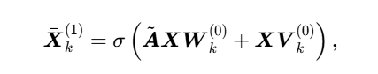
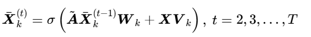
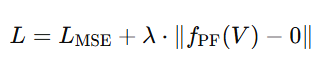

# Power Flow Balancing With Decentralized Graph Neural Networks论文解读
## 1. 为什么选择这篇论文
我首先将所有的论文大致速览了一遍，我觉得 AI 在特定领域应用的成功，绝不是纯粹的模型堆砌，而是对业务痛点和现有局限性的深刻理解。从而我觉得要入门电力人工智能领域需要结合业务来选择模型，那么首先需要做到大致了解电力业务以及电力业务目前的研究状况和局限性，因此我选择了这一篇论文作为第一篇精读的论文。通过其了解业务特性和业务中可能存在的将人工智能模型应用于此的场景。
## 2. 背景介绍与相关背景知识
通过阅读abstract可知，该论文大致上做了一件这样的事情：将电力中的“潮流分析”问题用图神经网络来解决。为此首先需要了解“潮流分析”是什么意思，通过阅读论文的”The Power Flow Problem“部分和在网上查找资料得知，“潮流分析”是在电力系统给定运行条件和系统接线方式下，对系统的电压分布、功率分布进行求解，本质上就是电路问题，求电压、功率等。
而论文这一段”Adistinction must be made between power flow (PF)– also called AC power flow (ACPF)– and optimal power flow (OPF) problems; while the former is solving a system of equations,the latter minimizes a cost function subject to constraints that include the PF equations. This paper focuses on PF.“则说明，需对潮流（Power Flow，简称 PF，又称交流潮流 AC Power Flow，简称 ACPF）与最优潮流（Optimal Power Flow，简称 OPF）两类问题加以区分：前者旨在求解一组方程组，后者则是在包含潮流方程的约束条件下，实现成本函数的最小化。而这个论文的研究重点为潮流问题。这里面又有了一些问题，论文里面经常提到一个词叫母线（buses），母线是什么意思呢？维基百科查阅母线定义：”在电力系统中，母线是指在输配电系统中，配电盘、配电箱、变电站等使用的导电的铜线或铝线，用以连接同一电压的线路。“我理解为母线就是电力系统里的一个电气节点，把所有连在一起、可以认为电压相同的设备（发电机、负荷、变压器、线路）抽象成一个点。而论文中介绍每个母线理论上有四个主要电气变量：电压幅值∣𝑉∣电压相角 𝜃 有功功率 𝑃和无功功率 Q。 **👉 但注意：在实际运行中，这四个量里有些是“已知的控制量”，有些是“未知的结果”。所以工程师就把母线分成不同类型。** 而论文中说潮流分析的本质为”Typically, the aim of power flow balancing is to find the complex voltages on the buses that satisfy the balance equations“，意思应该是通常而言，潮流平衡的核心目标是求解母线的复电压，使其满足式（1）与式（2）中的平衡方程。
## 3.传统方法的局限性
目前我对背景知识还是比较模糊的，但是我大概知道这是做什么的了，如果我理解的没错，以人工智能的观点来看，潮流分析可以抽象成 **已知一些输入量（负荷、发电、网络参数） → 计算一组未知量（母线电压、线路潮流），并且这些解必须满足物理约束（功率平衡方程）的回归问题** 。而传统方法大概就是根据基尔霍夫定律为每个母线一个有功方程 + 一个无功方程，根据母线类型决定“已知”和“未知”变量，然后通过一些迭代的求解非线性方程组的方法来进行迭代求解。论文上说，这种方法精度高，但迭代过程复杂，计算量大。而一些近似方法则是舍弃了精度从而减少计算量。

而一些使用传统深度学习的方法诸如MLP的大致流程不是去解方程（像 NR 那样迭代），而是学习“输入条件 → 潮流结果”的映射关系。其输入 (x)通常包括：母线的特征（负荷、发电机设定值、电压约束等）和线路的特征（阻抗、电抗、变压器参数），输出 (y)为母线电压（|V| 和 θ）或者线路潮流（有功 P、无功 Q、电流）。其训练过程训练过程首先用传统方法（NR）先生成大量训练样本（输入 + 精确解）。之后用 MLP 学习这种映射关系。采用损失函数：预测值和真实潮流解之间的均方误差 (MSE)。论文里特别强调MLP 的局限性：

**拓扑依赖强**：输入维度固定，电网母线/支路数变了，就没法直接用。

**泛化性差**：换一个电网（即使只是少几根线），模型就不能用了。

**掩码方案低效**：有些人用“变量超集+填充无效值”来兼容不同电网，但浪费容量，还学不到真实物理关系。

**容易过拟合**：参数多，容易记住训练集，遇到新工况误差大。

而我个人觉得是不是还有两个缺陷论文没有提出呢？首先是我看其参考文献【19】的算法流程采用标准 MLP 方法 没有把约束写进模型，而是“数据驱动地间接学到约束”。MLP 并没有显式地保证预测结果一定满足 功率平衡约束（也就是潮流方程）。它只是学会了“在训练数据分布下，大多数时候结果大致满足”。一旦遇到新的电网工况，预测结果可能违反物理规律（比如功率不守恒）。其次是没有利用不同母线之间数据特征之间的相关性呢？

接下来就到了GNN了，看了问题定义之后我觉得使用GNN是很容易想到的事情，因为电力系统天然就是一张 图 (Graph)：节点 (Nodes) = 母线 (Bus) 边 (Edges) = 线路、变压器 每个母线、线路都有特征（电压、电抗、功率、阻抗等）。于是可以把潮流分析建模为：在图上传播信息 → 预测母线电压 / 线路潮流。GNN优点在于：

**拓扑自适应**：不用固定输入维度，母线数量变了也能处理。

**物理一致性更强**：消息传递天然符合“功率沿线路传播”的物理直觉。

**泛化能力好**：在一张电网上训练过的 GNN，可以在另一张拓扑类似的电网中迁移。

而论文重点批评的部分也是传统GNN局限性在于：

**过平滑 (Over-smoothing)**：堆叠太多层时，所有母线特征会趋于相似，导致不同母线解不出差异。但电网里邻居母线可能差异很大（比如发电机 vs 负荷母线）。

**远程依赖难建模**：一个发电机的调节可能影响很远的负荷母线。普通 GNN 需要很多层才能捕捉远程关系，容易过平滑。

**部分方法还是中心化**：比如依赖全局导纳矩阵，拓扑一变就要重新计算，破坏“去中心化”的优势。（导纳矩阵是什么意思不知道，我估计和图的邻接矩阵关系很大吧）

**支路特征利用不足**：一些早期 GNN 只考虑了母线特征，没能充分利用支路的物理量（电阻、电抗、变比等）。

# 该论文的创新点
作者为了解决过平滑问题和在计算潮流解时，连接发电机的母线需区别对待，这增加了 GNN 的训练复杂度。此外，多数 GNN 模型仅能处理顶点（母线）的属性，无法处理边（分支）的属性这两个问题提出了本文的算法。

我首先重点讨论第二个挑战。论文里面描述道，在传统母线图里，有的母线是 Slack、有的是 PV、有的是 PQ，它们的约束不一样 → 如果直接把母线作为节点，就要对不同节点“区别对待”，难以做到完全去中心化。而在在GNN 里，“去中心化”通常指：每个节点的更新只依赖于 自己和邻居的信息，不依赖全局矩阵或中心节点。并且模型对不同拓扑都能工作（因为只需要局部邻接关系，不需要固定的全局输入维度）。那么论文是怎么做到的呢？论文里面采用了**线图**来代替传统GNN里面的**母线图**。传统GNN一般把母线直接当场节点，母线之间的连接作为边。而在论文中，“线图”（Line Graph）是一种​​将原始电网拓扑转化为新图结构的数学表示方法​​，其核心思想是将​​支路（Branch）作为顶点​​、​​支路间的连接关系作为边​​。具体的做法是在线图里，“邻居”就是共享母线的支路。每个支路节点通过 GNN 层和邻居交换信息，逐步把全网的影响传递开。由于是局部操作（只看邻居），所以模型是完全去中心化的。举个例子假设原始电网包含3条母线（A, B, C）和3条支路（Branch1: A-B, Branch2: B-C, Branch3: A-C）：

节点（Nodes）：Bus A, Bus B, Bus C
连边（Edges）：Branch1, Branch2, Branch3

```
Bus A --- Branch1 --- Bus B --- Branch2 --- Bus C
    \                             /
     \-------- Branch3 ---------/
```

母线图包含三个节点（三个母线）和三条连边（三条支路）节点特征只包含了母线本身的数据。

​​将其线图转换​​：
顶点：Branch1, Branch2, Branch3
连边：Branch1与Branch2共享Bus B → 相连
Branch1与Branch3共享Bus A → 相连
Branch2与Branch3共享Bus C → 相连

```
​​结构​​：Branch1 — Branch2
 │    │
 └── Branch3 ──┘
```

 最终结果还是三个节点三条边，只不过每个​​顶点（对应原始电网的支路）​​ 的特征向量​​同时融合了支路自身属性和两端母线的物理特征​​。因此采用此结构，使得所有节点都统一处理；并且不依赖全局矩阵；同时可以适应任意拓扑和规模。而且可见线图是一个无向图，论文中说虽然分支（尤其是变压器分支）存在 “起始端（from）” 和 “终止端（to）” 的方向性，但采用有向图会导致 “单向边链末端的末梢顶点无法与图其他部分传递信息”，阻碍 GNN 的图扩散过程，影响学习效果。因此，本文仍采用无向图表示。

 接下来再说论文的第一个挑战为了解决GNN常见的过平滑问题作者提出了ARMA GNN：

 第一层：
 


深层：



每个 ARMA 层包含K个堆叠模块，最终平均K个块得到结果。

然后作者还改进了MLP层，采用局部 MLP 模型，其仅利用每条分支的相关输入特征对该分支进行预测。换言之，每条分支的 8 个目标输出值（功率、电流的实部与虚部），均通过前文提到的 21 维输入顶点特征（分支特征 + 两端母线特征）进行预测，而不是全局 MLP 模型，其利用所有母线和分支的输入特征，同时对所有分支进行预测。为实现这一目标，所有母线和分支的输入特征被分别拼接成两个一维数组；此外，为减少输入层的参数数量，母线特征和分支特征会先通过各自独立的处理层进行处理，这些处理层的输出再被拼接后输入到模型的隐藏层。可以看到全局MLP强依赖于分支的数量。

#个人见解
针对于第一个创新点，PYG里面有接口可以直接调用：conv.ARMAConv  并且我个人觉得conv.ARMAConv和图残差网络差不多，除了多了一个平均和对本身特征乘以可学习的矩阵这个过程。PYG源码：

```
from typing import Callable, Optional

import torch
import torch.nn.functional as F
from torch import Tensor, nn
from torch.nn import Parameter, ReLU

from torch_geometric.nn.conv import MessagePassing
from torch_geometric.nn.conv.gcn_conv import gcn_norm
from torch_geometric.nn.inits import glorot, zeros
from torch_geometric.typing import Adj, OptTensor, SparseTensor
from torch_geometric.utils import spmm


[docs]class ARMAConv(MessagePassing):
    r"""The ARMA graph convolutional operator from the `"Graph Neural Networks
    with Convolutional ARMA Filters" <https://arxiv.org/abs/1901.01343>`_
    paper.

    .. math::
        \mathbf{X}^{\prime} = \frac{1}{K} \sum_{k=1}^K \mathbf{X}_k^{(T)},

    with :math:`\mathbf{X}_k^{(T)}` being recursively defined by

    .. math::
        \mathbf{X}_k^{(t+1)} = \sigma \left( \mathbf{\hat{L}}
        \mathbf{X}_k^{(t)} \mathbf{W} + \mathbf{X}^{(0)} \mathbf{V} \right),

    where :math:`\mathbf{\hat{L}} = \mathbf{I} - \mathbf{L} = \mathbf{D}^{-1/2}
    \mathbf{A} \mathbf{D}^{-1/2}` denotes the
    modified Laplacian :math:`\mathbf{L} = \mathbf{I} - \mathbf{D}^{-1/2}
    \mathbf{A} \mathbf{D}^{-1/2}`.

    Args:
        in_channels (int): Size of each input sample, or :obj:`-1` to derive
            the size from the first input(s) to the forward method.
        out_channels (int): Size of each output sample
            :math:`\mathbf{x}^{(t+1)}`.
        num_stacks (int, optional): Number of parallel stacks :math:`K`.
            (default: :obj:`1`).
        num_layers (int, optional): Number of layers :math:`T`.
            (default: :obj:`1`)
        act (callable, optional): Activation function :math:`\sigma`.
            (default: :meth:`torch.nn.ReLU()`)
        shared_weights (int, optional): If set to :obj:`True` the layers in
            each stack will share the same parameters. (default: :obj:`False`)
        dropout (float, optional): Dropout probability of the skip connection.
            (default: :obj:`0.`)
        bias (bool, optional): If set to :obj:`False`, the layer will not learn
            an additive bias. (default: :obj:`True`)
        **kwargs (optional): Additional arguments of
            :class:`torch_geometric.nn.conv.MessagePassing`.

    Shapes:
        - **input:**
          node features :math:`(|\mathcal{V}|, F_{in})`,
          edge indices :math:`(2, |\mathcal{E}|)`,
          edge weights :math:`(|\mathcal{E}|)` *(optional)*
        - **output:** node features :math:`(|\mathcal{V}|, F_{out})`
    """
    def __init__(self, in_channels: int, out_channels: int,
                 num_stacks: int = 1, num_layers: int = 1,
                 shared_weights: bool = False,
                 act: Optional[Callable] = ReLU(), dropout: float = 0.,
                 bias: bool = True, **kwargs):
        kwargs.setdefault('aggr', 'add')
        super().__init__(**kwargs)

        self.in_channels = in_channels
        self.out_channels = out_channels
        self.num_stacks = num_stacks
        self.num_layers = num_layers
        self.act = act
        self.shared_weights = shared_weights
        self.dropout = dropout

        K, T, F_in, F_out = num_stacks, num_layers, in_channels, out_channels
        T = 1 if self.shared_weights else T

        self.weight = Parameter(torch.empty(max(1, T - 1), K, F_out, F_out))
        if in_channels > 0:
            self.init_weight = Parameter(torch.empty(K, F_in, F_out))
            self.root_weight = Parameter(torch.empty(T, K, F_in, F_out))
        else:
            self.init_weight = torch.nn.parameter.UninitializedParameter()
            self.root_weight = torch.nn.parameter.UninitializedParameter()
            self._hook = self.register_forward_pre_hook(
                self.initialize_parameters)

        if bias:
            self.bias = Parameter(torch.empty(T, K, 1, F_out))
        else:
            self.register_parameter('bias', None)

        self.reset_parameters()

[docs]    def reset_parameters(self):
        super().reset_parameters()
        glorot(self.weight)
        if not isinstance(self.init_weight, torch.nn.UninitializedParameter):
            glorot(self.init_weight)
            glorot(self.root_weight)
        zeros(self.bias)

[docs]    def forward(self, x: Tensor, edge_index: Adj,
                edge_weight: OptTensor = None) -> Tensor:

        if isinstance(edge_index, Tensor):
            edge_index, edge_weight = gcn_norm(  # yapf: disable
                edge_index, edge_weight, x.size(self.node_dim),
                add_self_loops=False, flow=self.flow, dtype=x.dtype)

        elif isinstance(edge_index, SparseTensor):
            edge_index = gcn_norm(  # yapf: disable
                edge_index, edge_weight, x.size(self.node_dim),
                add_self_loops=False, flow=self.flow, dtype=x.dtype)

        x = x.unsqueeze(-3)
        out = x
        for t in range(self.num_layers):
            if t == 0:
                out = out @ self.init_weight
            else:
                out = out @ self.weight[0 if self.shared_weights else t - 1]

            # propagate_type: (x: Tensor, edge_weight: OptTensor)
            out = self.propagate(edge_index, x=out, edge_weight=edge_weight)

            root = F.dropout(x, p=self.dropout, training=self.training)
            root = root @ self.root_weight[0 if self.shared_weights else t]
            out = out + root

            if self.bias is not None:
                out = out + self.bias[0 if self.shared_weights else t]

            if self.act is not None:
                out = self.act(out)

        return out.mean(dim=-3)

    def message(self, x_j: Tensor, edge_weight: Tensor) -> Tensor:
        return edge_weight.view(-1, 1) * x_j

    def message_and_aggregate(self, adj_t: Adj, x: Tensor) -> Tensor:
        return spmm(adj_t, x, reduce=self.aggr)

    @torch.no_grad()
    def initialize_parameters(self, module, input):
        if isinstance(self.init_weight, nn.parameter.UninitializedParameter):
            F_in, F_out = input[0].size(-1), self.out_channels
            T, K = self.weight.size(0) + 1, self.weight.size(1)
            self.init_weight.materialize((K, F_in, F_out))
            self.root_weight.materialize((T, K, F_in, F_out))
            glorot(self.init_weight)
            glorot(self.root_weight)

        module._hook.remove()
        delattr(module, '_hook')

    def __repr__(self) -> str:
        return (f'{self.__class__.__name__}({self.in_channels}, '
                f'{self.out_channels}, num_stacks={self.num_stacks}, '
                f'num_layers={self.num_layers})')
```

#个人理解：
综上我觉得这个论文所表述的问题未来可以探索的地方有：

**1.异构图建模：** 论文上面说”在传统母线图里，有的母线是 Slack、有的是 PV、有的是 PQ，它们的约束不一样 → 如果直接把母线作为节点，就要对不同节点“区别对待”，难以做到完全去中心化“，但是如果做到了去中心化是不是会丢失一些重要特征呢？也就是邻接矩阵连边的语义特征，因为邻接矩阵本来就是包含了不同的节点类型，而PV节点到Slack节点，和Slack节点到PV节点所表示的语义应该是不一样的吧，比如一个社交网络演员节点到导演节点和导演节点到演员节点应该是不一样的，演员找导演可以代表的是演员求导演给自己角色，而导演到演员则可能是导演要求演员演什么角色，我觉得电力系统也是同理，因此将其建模为这种同构无向图我觉得是不合适的，会丢失重要的语义特征。而如何解决这种问题，我觉得建模的时候应该保留这种异构性，也就是将模型建模为异构图，而采用异构图神经网络诸如HAN等等来解决异构图上的问题。

**2.过平滑问题：** 这个论文的一大创新点就在于缓解GNN的过平滑问题，但是目前使用了ARMAConv这个基于图残差结构的模型只能说是缓解GNN过平滑问题，因此我们应该聚焦于如何训练GNN，具体可以参考这个论文：Training Graph Neural Networks with 1000 Layers，这个论文是把图的节点特征按照通道进行划分，采用了图残差结构，从而训练了非常深的图神经网络也没有出现过平滑，并且保持了较小的空间复杂度。

 **3.边特征问题：** 这个论文以其他GNN论文构建的母线图没有考虑边特征，从而将边特征和母线节点特征融合在一起构建了线图，但是这样共享母线特征会不会造成了特征冗余呢？
 而论文里面只讨论了GCN这种最经典的图神经网络，因此我们是否可以还是保留母线图模式而是采用一些可以同时融合边特征和节点特征的图神经网络呢？比如Attributed Multiplex GNN和Co‑embedding of edges and nodes with deep graph convolutional neural networks这种图神经网络呢？

 **4.训练标签问题：** 论文上面没有表示，但是我个人觉得为GNN的训练而采用传统方法生成大量标签本身就不合适，因为如果要是有大量标签生成的时间那为什么不直接使用传统方法进行预测呢？那样精度还更高？我觉得应该利用GNN的消息传播特性，将潮流分析问题转化为图上的半监督问题甚至无监督生成问题。假设我们将母线作为图上的节点，那么不同的节点的特征应该是有一些部分缺失，这也是我们要预测的部分，传统方法是将其作为label。而我觉得则可以将缺省特征补零一起作为节点特征进行训练，而任务就是生成自己，这样我们可以采用无监督或者半监督，只需要图上极少节点的标签就可以完成训练。甚至我们可以使用图对比学习进行图节点特征的自我生成补全。

 **5.图结构问题：** 可能我不是太了解，但是我觉得潮流计算这个问题真的需要图结构吗？可不可以我就看一个母线，根据母线的历史信息来预测我当前特征呢？如果可以的话该问题可以转化为时间序列预测问题，我们可以使用一些时间序列预测的手段诸如：A TIME SERIES IS WORTH 64 WORDS:LONG-TERM FORECASTING WITH TRANSFORMERS、Autoformer: Decomposition Transformers with auto-Correlation for Long-Term Series Forecasting甚至是最返璞归真的Dlinear：Are Transformers Effective for Time Series
 Forecasting?来实现。甚至可以使用一些时间序列的大模型诸如：Timer、TimesGPT等等。

 **6.时间特征问题：** 如果问题5的答案是强依赖于图结构的话，那我们可不可以在保留图结构的同时引入时间维度的特征呢？就是每个节点的特征会随着时间变化，那样我们可以将电力系统建模为时空动态图，我们就可以借助一些交通流量预测、网络流量分析的时空图神经网络诸如：ST-GNN、ST-GCN等等来进行解决。

 **7、物理建模问题：** 我觉得目前的以深度学习为基础的潮流计算都忽略了一个点，也就是深度学习方法方法 没有把约束写进模型，而是“数据驱动地间接学到约束”（也可能是我看的论文比较少），因此这样会导致预测结果可能违反物理规律（比如功率不守恒），而我觉得 AI 在特定领域应用的成功，绝不是纯粹的模型堆砌，而是对业务痛点和现有局限性的深刻理解，所以我觉得因此我们可以引入物理引导损失函数，除了预测值和真实解的误差，还在损失里加上潮流方程残差。
 
 
 
 或者输出层加约束映射让模型输出不是“电压直接值”，而是“满足方程的参数”，再通过物理公式推回潮流结果。或者采用PINN混合方法 (Hybrid)用 PINN 给一个初值 → 再用一次 Newton-Raphson 微调，使结果严格满足方程。好处在于速度比从零迭代快，精度和物理约束又能保证。

 **8、泛化性问题：**，我觉得为了泛化性使模型可以泛化到不同电网上我觉得是不是可以采用一些预训大模型呢？诸如一些时间序列大模型Timer、TimesGPT等等或者图大模型Graph-Bert、GraphGPT、GraphLLM等等，或者将电网特征数据进行token化直接送入诸如chatgpt、deepseek等模型中呢？参见将时许数据转化为表格从而使用大模型预测的论文（名字记不住了）等等。

以上就是我对业务的一些粗浅理解，其中提到的所有相关论文都是在我读过的前提下结合我个人理解的业务场景从而想到的，我觉得上述内容如果我提到的哪一条行得通或者是一个探索的方向的话，则那部分我提到的相关论文可以读一读，文件夹论文里面是我上面提到的一部分相关论文，因为我不在学校所以无法自由下载IEEE的论文，所以只有一部分。
